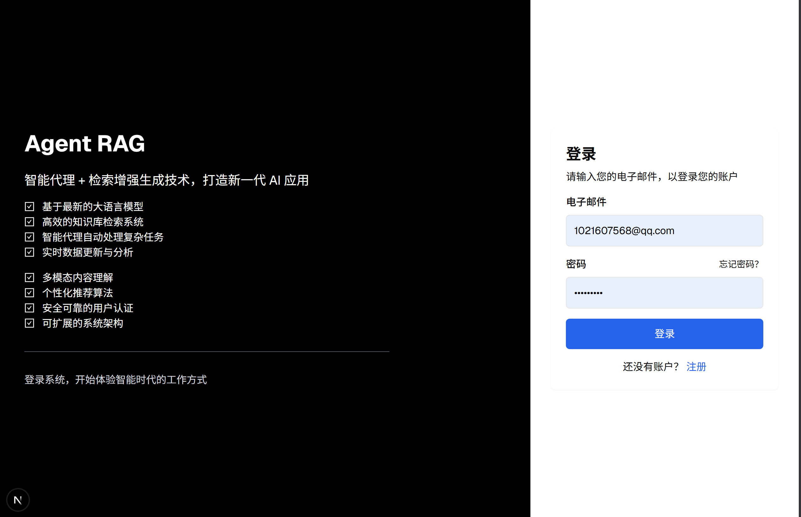
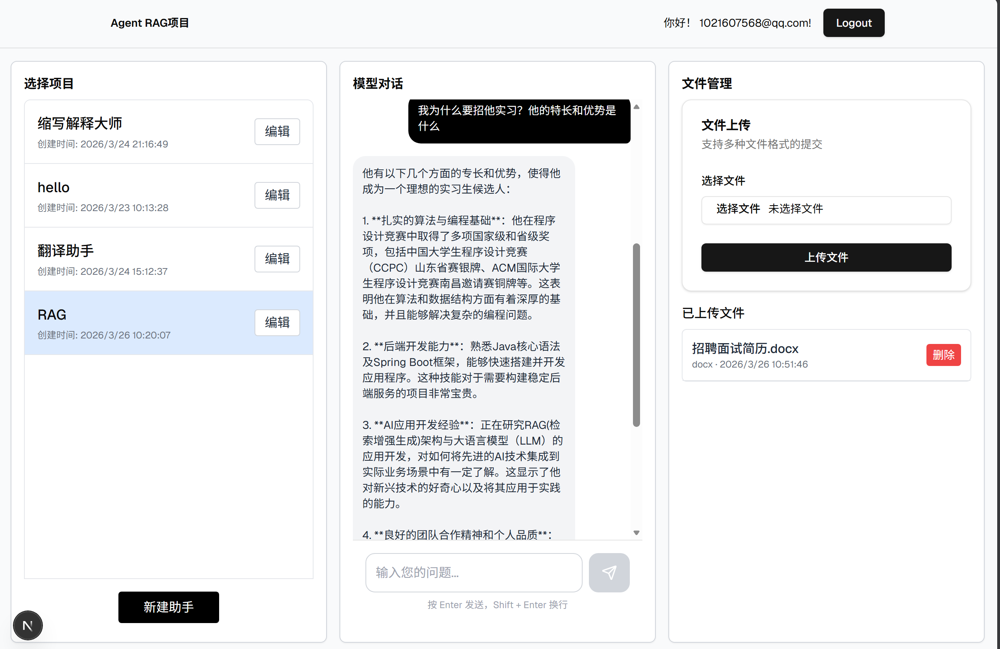
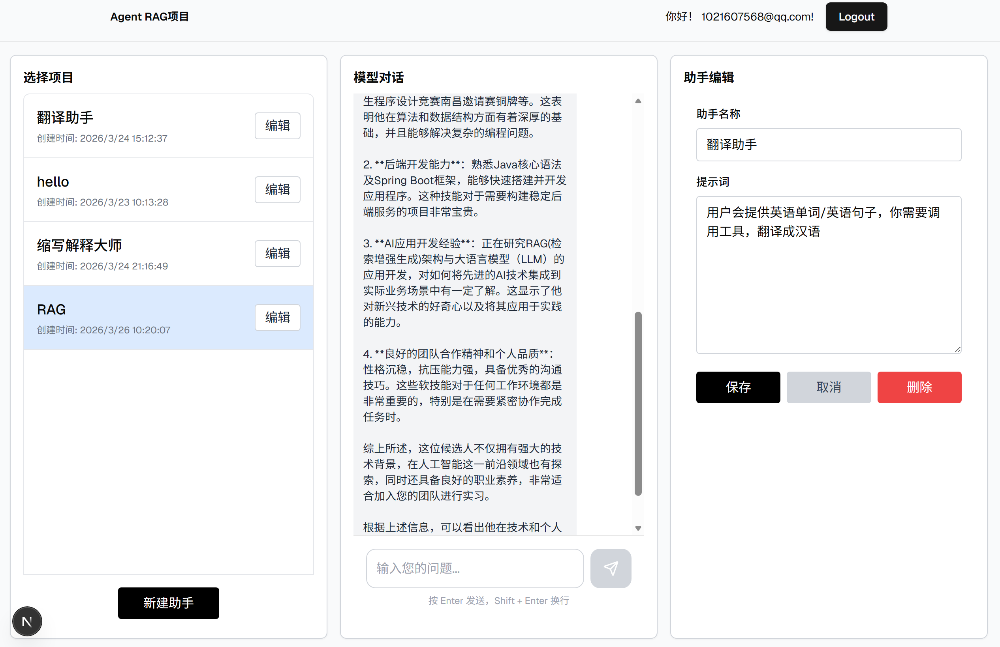

# 智能助手 RAG 系统

一个基于 RAG（检索增强生成）技术的智能助手管理系统，支持多 Agent 管理、文件上传、向量检索和智能对话功能。

## 界面展示

### 登陆界面


### 用户界面


### 用户设置提示词


## 技术栈

- **前端**: Next.js 14 + React + TypeScript + Tailwind CSS
- **后端**: FastAPI + Python
- **数据库**: Supabase (PostgreSQL)
- **缓存**: Redis
- **向量检索**: OpenAI Embeddings
- **认证**: JWT + Supabase Auth

## 功能特性

### 核心功能
- **多 Agent 管理**: 创建、编辑、删除多个智能助手
- **文件上传**: 支持多种文件格式（Word、PDF、TXT、图片等）
- **智能对话**: 基于上传文件内容的智能问答
- **向量检索**: 自动将文件内容切片并生成向量嵌入
- **用户认证**: 基于 JWT 的安全认证系统

### 技术特性
- 服务器端渲染（SSR）和客户端组件分离
- 响应式设计，支持多设备访问
- 实时文件列表更新
- 状态管理（Agent 选择、编辑状态等）
- 优雅的错误处理和用户提示

## 项目结构

```
agent_rag_1/
├── app/                      # Next.js 应用目录
│   ├── page.tsx              # 主页面
│   └── api/                 # API 路由
├── components/               # React 组件
│   ├── agent-list/          # Agent 管理相关组件
│   ├── rag-model/           # RAG 功能相关组件
│   ├── chat-model/          # 聊天功能相关组件
│   ├── navigation-bar/       # 导航栏组件
│   └── frame/              # 框架组件
├── backend/                 # FastAPI 后端
│   ├── main.py             # 主应用入口
│   ├── receive_file.py      # 文件上传处理
│   ├── recent.py           # 最近对话接口
│   ├── chat.py            # 聊天接口
│   ├── auth.py            # 认证接口
│   └── rag/              # RAG 相关功能
│       ├── extract_word.py # Word 文件处理
│       └── search_similar_content.py # 向量检索
├── lib/                    # 工具库
│   ├── supabase/          # Supabase 客户端
│   └── agent.ts           # Agent 相关函数
└── public/                # 静态资源
```

## 安装和运行

### 前置要求
- Node.js 18+
- Python 3.9+
- Supabase 账户
- Redis 服务

### 前端设置

1. 安装依赖：
```bash
npm install
```

2. 配置环境变量：
创建 `.env.local` 文件：
```env
NEXT_PUBLIC_SUPABASE_URL=your_supabase_url
NEXT_PUBLIC_SUPABASE_ANON_KEY=your_supabase_anon_key
```

3. 启动开发服务器：
```bash
npm run dev
```

前端将在 `http://localhost:3000` 运行。

### 后端设置

1. 安装依赖：
```bash
cd backend
pip install -r requirements.txt
```

2. 配置环境变量：
创建 `.env` 文件：
```env
SUPABASE_URL=your_supabase_url
SUPABASE_SERVICE_KEY=your_supabase_service_key
OPENAI_API_KEY=your_openai_api_key
REDIS_URL=redis://localhost:6379
JWT_SECRET=your_jwt_secret
```

3. 启动后端服务：
```bash
cd backend
uvicorn main:app --reload --host 0.0.0.0 --port 8000
```

后端 API 将在 `http://localhost:8000` 运行。

### 数据库设置

在 Supabase 中创建以下表：

#### agent 表
```sql
CREATE TABLE agent (
  id BIGINT GENERATED BY DEFAULT AS IDENTITY PRIMARY KEY,
  created_at TIMESTAMP WITH TIME ZONE NOT NULL DEFAULT NOW(),
  user_id UUID REFERENCES auth.users(id) ON UPDATE CASCADE ON DELETE CASCADE,
  agent_name TEXT NOT NULL,
  prompt TEXT
);
```

#### rag_files 表
```sql
CREATE TABLE rag_files (
  id BIGINT GENERATED BY DEFAULT AS IDENTITY PRIMARY KEY,
  created_at TIMESTAMP WITH TIME ZONE NOT NULL DEFAULT NOW(),
  user_id UUID REFERENCES auth.users(id) ON UPDATE CASCADE ON DELETE CASCADE,
  agent_id BIGINT REFERENCES agent(id) ON UPDATE CASCADE ON DELETE CASCADE,
  file_title TEXT NOT NULL DEFAULT '新建文件',
  file_type TEXT,
  CONSTRAINT rag_files_file_title_key UNIQUE (file_title)
);
```

#### rag_vec 表
```sql
CREATE TABLE rag_vec (
  id BIGINT GENERATED BY DEFAULT AS IDENTITY PRIMARY KEY,
  created_at TIMESTAMP WITH TIME ZONE NOT NULL DEFAULT NOW(),
  agent_id BIGINT REFERENCES agent(id) ON UPDATE CASCADE ON DELETE CASCADE,
  file_id BIGINT REFERENCES rag_files(id) ON UPDATE CASCADE ON DELETE CASCADE,
  content TEXT,
  vec VECTOR(1536)
);
```

## 使用说明

### 登录系统
使用 Supabase 认证登录系统。

### 创建 Agent
1. 点击"创建新 Agent"按钮
2. 输入 Agent 名称和提示词
3. 保存后 Agent 将出现在列表中

### 上传文件
1. 选择一个 Agent
2. 在文件管理区域选择要上传的文件
3. 点击"上传文件"按钮
4. 文件将自动处理并生成向量嵌入

### 智能对话
1. 选择一个 Agent
2. 在对话区域输入问题
3. 系统将基于上传的文件内容提供回答

### 编辑 Agent
1. 点击 Agent 列表中的"编辑"按钮
2. 修改 Agent 信息
3. 保存或取消编辑

### 删除文件
1. 在文件列表中找到要删除的文件
2. 点击"删除"按钮
3. 确认删除操作

## API 接口

### 认证接口
- `POST /auth/login` - 用户登录
- `GET /auth/token` - 获取 JWT 令牌

### Agent 管理
- `GET /agents` - 获取 Agent 列表
- `POST /agents` - 创建新 Agent
- `PUT /agents/{id}` - 更新 Agent
- `DELETE /agents/{id}` - 删除 Agent

### 文件管理
- `POST /receive_files` - 上传文件
- `GET /rag_files?agent_id={id}` - 获取文件列表

### 对话接口
- `POST /chat` - 发送消息并获取回复
- `POST /recent` - 获取最近对话

## 开发说明

### 前端开发
- 使用 Next.js App Router
- 组件分为服务器组件和客户端组件
- 使用 Context API 进行状态管理
- 使用 Supabase 客户端直接访问数据库

### 后端开发
- 使用 FastAPI 构建 RESTful API
- 使用 Supabase Python 客户端
- 使用 Redis 进行缓存
- 使用 OpenAI API 生成向量嵌入

### 文件处理
- Word 文件：使用 python-docx 提取文本
- PDF 文件：使用 PyPDF2 提取文本
- 图片文件：使用 OCR 提取文本
- 文本切片：使用滑动窗口算法

## 故障排除

### 常见问题

1. **文件上传失败**
   - 检查文件格式是否支持
   - 确认文件大小是否超出限制
   - 检查后端服务是否正常运行

2. **对话无响应**
   - 检查 OpenAI API 密钥是否有效
   - 确认向量数据是否正确生成
   - 检查 Redis 服务是否运行

3. **认证失败**
   - 确认 Supabase 配置正确
   - 检查 JWT 密钥设置
   - 验证用户权限

## 贡献指南

欢迎提交 Issue 和 Pull Request！

## 许可证

MIT License

## 联系方式

如有问题或建议，请通过以下方式联系：
- 提交 Issue
- 发送邮件

---

**注意**: 本项目仅用于学习和研究目的。
